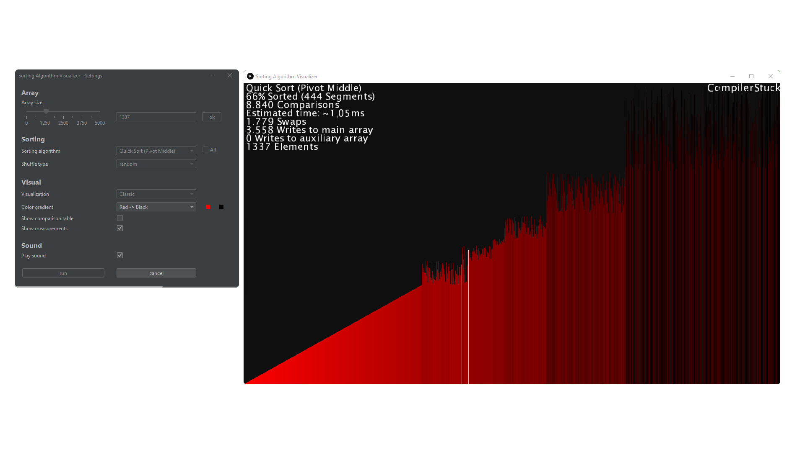

 

  

  <h1 align="center">Sorting Algorithm Visualizer</h1>

  

    Visualizes and Audiolizes Sorting Algorithms! 
    (Not actively maintained)
     
     
    <a href="https://github.com/66-m/sorting-visualizer/releases/latest"><strong>Try it »</strong></a>
     
     
    ·
    <a href="https://github.com/66-m/sorting-visualizer/issues">Report Bug / Request Feature</a>
    

 
This sorting visualizer offers both visual and auditory demonstrations of sorting algorithms. It features 22 different sorting methods represented through a collection of 27 visuals, including a selection of 3D models. A settings menu is included to enable users to adjust the appearance and functionality of the visualizer.

        
  

## Downloading and running the visualizer
You can download the latest version of this visualizer [here](https://github.com/66-m/sorting-visualizer/releases/latest)

Download the [prebuilt JAR file](https://github.com/66-m/sorting-visualizer/releases/latest/download/sorting-visualizer.jar) and run it with

        java -jar sorting-visualizer.jar

## Building the project yourself
### Requirements:

* An installed JDK. Download [here](https://jdk.java.net/21/)
* Make sure your [environment variables](https://www.baeldung.com/java-home-on-windows-7-8-10-mac-os-x-linux) are set.

### Clone this repository:

        git clone https://github.com/66-m/sorting-visualizer.git
        cd sorting-visualizer

### Building the Code:

1. Open a Terminal in the project folder and execute: 

        ./build

2. Run the compiled jar with

        ./run
        

## Features

* Selecting algorithms:
  - Quick Sort (Middle Pivot)
  - Quick Sort (Dual Pivot)
  - Merge Sort
  - Shell Sort
  - Selection Sort
  - Double Selection Sort
  - Insertion Sort
  - Heap Sort
  - Gravity Sort
  - Radix Sort (LSD, Base 10)
  - Gnome Sort
  - Comb Sort
  - Odd Even Sort
  - Bubble Sort
  - Cocktail Shaker Sort (Shaker Sort)
  - Cycle Sort
  - Counting Sort
  - American Flag Sort
  - Bucket Sort
  - Pigeonhole Sort
  - Tim Sort
  - Bogo Sort

* Running all algorithms
   - Changing the execution order
   - Selecting which algorithms to run

* Changing the array size

* Changing the shuffle type
   - Random
   - Reverse
   - Almost Sorted
   - Sorted

* Selecting Visualizations:
  - Bars
  - Scatter Plot
  - Scatter Plot Linked
  - Number Plot
  - Disparity Graph
  - Disparity Graph Mirrored
  - Horizontal Pyramid
  - Color Gradient Graph
  - Circle
  - Disparity Circle
  - Disparity Circle Scatter
  - Disparity Circle Scatter Linked
  - Disparity Chords
  - Disparity Square Scatter
  - Swirl Dots
  - Phyllotaxis
  - Image Vertical
  - Image Horizontal
  - Hoops
  - Morphing Shell
  - Sphere (3D)
  - Sphere Hoops (3D)
  - Disparity Sphere Hoops (3D)
  - Cube (3D)
  - Pyramid (3D)
  - Plane (3D)
  - Disparity Plane (3D)

* Selecting different color gradients and creating your own

* Showing Measurements during the execution
   - Sorted percentage
   - Counting comparisons
   - Measuring the estimated real time 
   - Counting swaps
   - Counting writes to the main array
   - Counting writes to possible auxiliary arrays

* Option to display a comparison table at the end of the execution

* Muting Sound

* Canceling execution

## Acknowledgements
Thanks to [w0rthy](https://www.youtube.com/c/w0rthyA) and [Musicombo](https://www.youtube.com/c/Musicombo) for their amazing videos and inspiring me to start this project.

Also thanks to [@micycle1](https://github.com/micycle1) for his mirror of the processing4 core library, making it available for maven.
