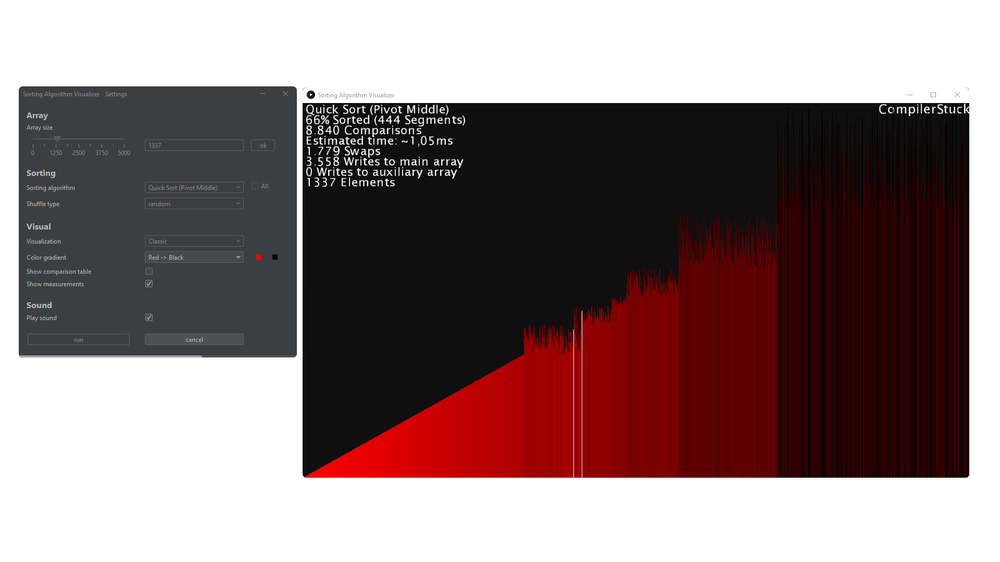

<div align="center">

  

  <h1>Sorting Algorithm Visualizer</h1>

  <p>Visualize and audiolize sorting algorithms in real time — with 22 algorithms, 30 visualizations, and full 3D support.</p>

  [](https://github.com/66-m/sorting-visualizer/actions/workflows/maven.yml)
  [](https://opensource.org/licenses/MIT)
  [](https://github.com/66-m/sorting-visualizer/releases/latest)

  <br/>

  [**Download latest release »**](https://github.com/66-m/sorting-visualizer/releases/latest)
  &nbsp;·&nbsp;
  [Report a bug or request a feature](https://github.com/66-m/sorting-visualizer/issues)

  <br/>

  

</div>

---

## Table of Contents

- [Getting Started](#getting-started)
- [Building from Source](#building-from-source)
- [Features](#features)
  - [Sorting Algorithms](#sorting-algorithms)
  - [Visualizations](#visualizations)
  - [Controls & Settings](#controls--settings)
- [Acknowledgements](#acknowledgements)

---

## Getting Started

Download the [prebuilt JAR](https://github.com/66-m/sorting-visualizer/releases/latest/download/sorting-visualizer.jar) and run it with:

```sh
java -jar sorting-visualizer.jar
```

> **Requires Java 25 or later.** Download from [jdk.java.net/25](https://jdk.java.net/25/).

---

## Building from Source

**Requirements:**
- JDK 25 or later — [download here](https://jdk.java.net/25/)
- Ensure your [JAVA_HOME environment variable](https://www.baeldung.com/java-home-on-windows-7-8-10-mac-os-x-linux) is set

**Clone and build:**

```sh
git clone https://github.com/66-m/sorting-visualizer.git
cd sorting-visualizer

# Build (using bundled Maven wrapper — recommended)
./mvnw clean package
# or use the convenience script:
./build
```

**Run:**

```sh
java -jar target/sorting-visualizer.jar
# or:
./run
```

> The `build` and `run` helper scripts are provided for Unix-like systems.

---

## Features

### Sorting Algorithms

22 algorithms available:

| | | |
|---|---|---|
| Quick Sort (Middle Pivot) | Quick Sort (Dual Pivot) | Merge Sort |
| Shell Sort | Selection Sort | Double Selection Sort |
| Insertion Sort | Heap Sort | Gravity Sort |
| Radix Sort (LSD, Base 10) | Gnome Sort | Comb Sort |
| Odd Even Sort | Bubble Sort | Cocktail Shaker Sort |
| Cycle Sort | Counting Sort | American Flag Sort |
| Bucket Sort | Pigeonhole Sort | Tim Sort |
| Bogo Sort | | |

**Algorithm run options:**
- Run all algorithms in sequence
- Change the execution order
- Select which algorithms to include

### Visualizations

30 visualizations including 3D models:

<details>
<summary>2D Visualizations (20)</summary>

- Bars
- Scatter Plot / Scatter Plot Linked
- Number Plot
- Disparity Graph / Disparity Graph Mirrored
- Horizontal Pyramid
- Color Gradient Graph
- Circle
- Disparity Circle / Disparity Circle Scatter / Disparity Circle Scatter Linked
- Disparity Chords
- Disparity Square Scatter
- Swirl Dots
- Phyllotaxis
- Image Vertical / Image Horizontal
- Hoops
- Morphing Shell
- Mosaic Squares

</details>

<details>
<summary>3D Visualizations (10)</summary>

- Sphere
- Sphere Hoops
- Spheric Disparity Lines
- Disparity Sphere Hoops
- Cube
- Cubic Lines
- Pyramid
- Plane
- Disparity Plane

</details>

### Controls & Settings

- **Array:** Configurable size and shuffle type (Random, Reverse, Almost Sorted, Sorted)
- **Color gradients:** Choose from presets or create your own
- **Speed:** Adjustable animation speed
- **Sound:** Toggle mute at any time
- **Live measurements:** sorted %, comparisons, swaps, array writes, auxiliary writes, estimated real time
- **Comparison table:** Optionally display a summary after all algorithms have run
- **Cancel:** Stop execution at any time

---

## Acknowledgements

Thanks to [w0rthy](https://www.youtube.com/c/w0rthyA) and [Musicombo](https://www.youtube.com/c/Musicombo) for their amazing videos and for inspiring this project.

Thanks to [@micycle1](https://github.com/micycle1) for his mirror of the processing4 core library, making it available for Maven.
