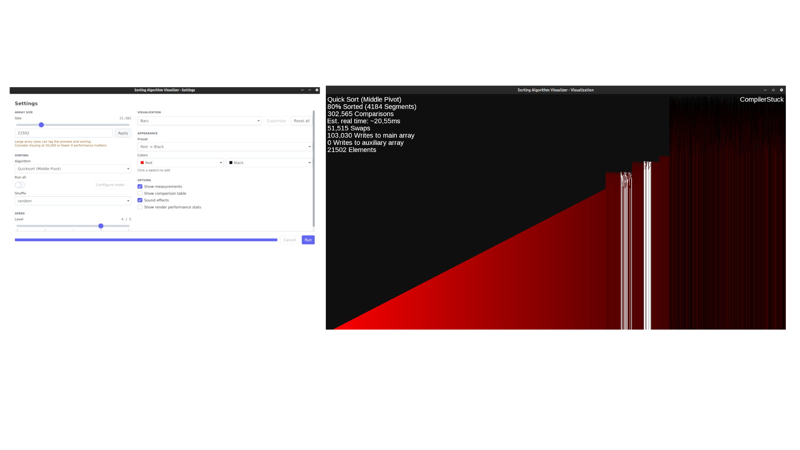

<div align="center">


# Sorting Algorithm Visualizer

See and hear sorting algorithms in real time — 22 algorithms, 30 visualizations, live metrics, and MIDI audio.

[](https://github.com/66-m/sorting-visualizer/actions/workflows/ci.yml)
[](https://www.gnu.org/licenses/agpl-3.0)
[](https://github.com/66-m/sorting-visualizer/releases/latest)

[Download](https://github.com/66-m/sorting-visualizer/releases/latest) · [Issues](https://github.com/66-m/sorting-visualizer/issues)



</div>

## Quick start

Requires **[JDK 26+](https://jdk.java.net/26/)**.

Download [`sorting-visualizer.jar`](https://github.com/66-m/sorting-visualizer/releases/latest/download/sorting-visualizer.jar), then:

```sh
java --enable-native-access=ALL-UNNAMED \
  --add-opens=java.desktop/com.sun.media.sound=ALL-UNNAMED \
  -jar sorting-visualizer.jar
```

Optional flags (after the JAR name; `fullscreen` wins over `portrait`):

| Flag | Effect |
|------|--------|
| `fullscreen` | Fullscreen visualization |
| `portrait` | Tall ~9:16 window |
| `--display=N` | Visualization on display `N` (1-based; default is 2 when multiple monitors exist) |

## Features

- Classic and niche sorts (Quick, Merge, Heap, Radix, Bogo, …), singly or run-all with a comparison table
- 2D and 3D visualizations, custom colors, optional MIDI sound
- Array sizes up to 100 000; live metrics and CSV export

## Build from source

```sh
git clone https://github.com/66-m/sorting-visualizer.git
cd sorting-visualizer
./mvnw clean package
./run
```

| Command | What it does |
|---------|----------------|
| `./build` | Package with tests |
| `./build skip-tests` | Fast package |
| `./run` | Launch (same flags as above) |

On Windows: `build.cmd`, `run.cmd`, or `mvnw.cmd`. Release packaging: [Contributing](CONTRIBUTING.md#packaging).

## Docs

- [Contributing](CONTRIBUTING.md)
- [Architecture](docs/architecture.md)
- [Add an algorithm](docs/add-algorithm.md)

## License

Copyright (C) 2020-2026 Marcel Mauel

Licensed under the [GNU Affero General Public License v3.0](https://www.gnu.org/licenses/agpl-3.0.html). See [`LICENSE`](LICENSE).
