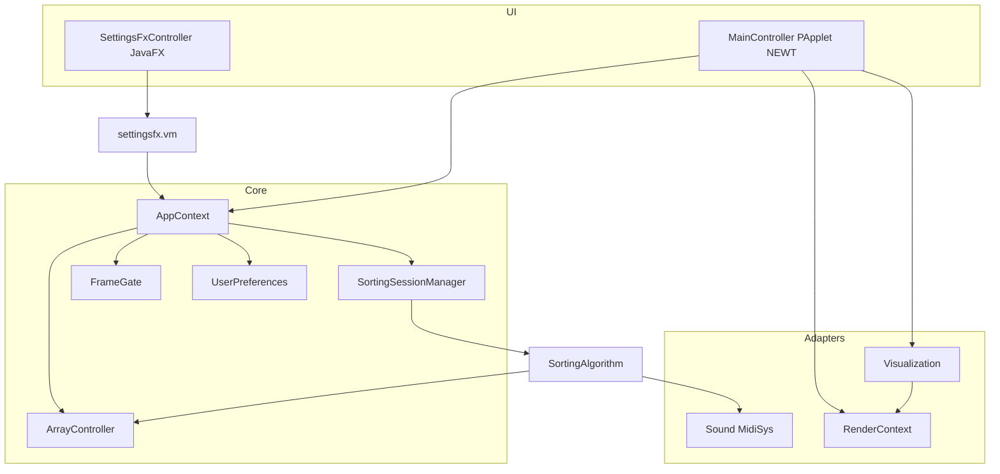

# Architecture

Versioned overview of the Sorting Algorithm Visualizer desktop app (JavaFX Settings cutover).

## Style

- **Monolith** — single Maven module, single JVM process
- **Dual toolkit UI** — Processing/NEWT OpenGL canvas (`MainController`) + JavaFX Settings (`SettingsFxController` / AtlantaFX Primer Light)
- **Worker thread** — algorithms run in `SortingSessionManager`; draw loop on Processing’s animation thread
- **Partial hexagonal ports** — `ArrayModel`, `RenderContext` / `ProcessingContext`, `Sound`, catalogs

Toolkit coexistence (NEWT + JavaFX) was proven in the Phase 0 spike: bootstrap JavaFX with `Platform.startup` **before** `PApplet.main`; Settings window close or canvas Esc → full shutdown (`Platform.exit()` + `PApplet.exit()`).

## Package map

```text
io.github.compilerstuck
├── control/                 # Orchestration, UI, model, config, render ports
│   ├── MainController       # PApplet entry; implements RenderContext
│   ├── AppContext           # Injectable façade for Settings (no static hub for UI ops)
│   ├── catalog/             # AlgorithmCatalog, VisualizationCatalog + descriptors
│   ├── config/              # SettingsDefaults, DelayStrategy, ShuffleType, prefs
│   ├── model/               # ArrayController, session/state, FrameGate, cancel
│   ├── render/              # RenderContext / Headless / LoadedImage
│   ├── shuffle/             # Shuffle strategies
│   └── ui/
│       ├── settingsfx/      # JavaFX Settings shell, sections, AtlantaFX theme
│       │   └── vm/          # Headless view-models (no javafx.* — ArchUnit)
│       ├── AppIcons         # NEWT / taskbar icons
│       └── ResultsTableRenderer, TimeEstimateFormat
├── sortingalgorithms/       # SortingAlgorithm base + implementations
├── visual/                  # Visualization subclasses + Marker + gradient/
└── sound/                   # Sound, MidiSys, SilentSound, HeadlessSound
```

## Runtime collaboration



## Key collaborators

| Piece | Role |
|-------|------|
| `AppContext` | Composition façade for Settings: size, speed, step engine, algorithm/visual/sound/gradient, persistence hooks |
| `settingsfx.vm.*` | Headless view-models (validation + AppContext); JavaFX sections bind via `PropertyChangeSupport` |
| `AlgorithmCatalog` / `VisualizationCatalog` | Stable IDs + factories; Settings builds instances from these |
| `FrameGate` | Steps-per-frame engine (opt-in via Settings or `-Dsv.stepEngine=true`) |
| `RenderContext` | Processing drawing API without casts in visuals |
| `CancellationToken` | Cooperative cancel from UI → session → algorithms |
| `UserPreferences` | `java.util.prefs` node `io/github/compilerstuck/sorting-visualizer` |

Settings view-models and sections depend on **`AppContext` only**. `MainController` is the Processing entry / composition root and keeps bootstrap statics (`processing`, `sound`, `app`) plus `shutdown()` / `cancelSorting()`.

## Lifecycle

Closing the Settings window or pressing `Esc` on the canvas quits both Settings and the visualization.

## Build & run

See [README](../README.md) and [CONTRIBUTING](../CONTRIBUTING.md). Architecture rules are enforced in tests via ArchUnit (`ArchitectureTest`) — including no `javafx.*` in algorithms/model/shuffle/view-models.
