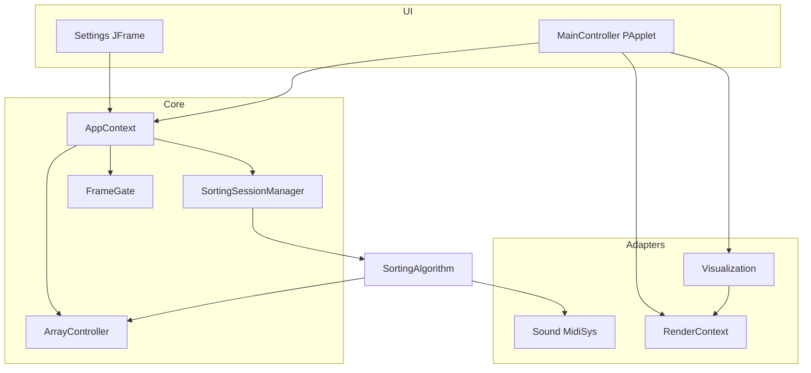

# Architecture

Versioned overview of the Sorting Algorithm Visualizer desktop app (post-P2).

## Style

- **Monolith** — single Maven module, single JVM process
- **Dual UI** — Processing `PApplet` canvas (`MainController`) + Swing settings (`Settings`)
- **Worker thread** — algorithms run in `SortingSessionManager`; draw loop on Processing’s thread
- **Partial hexagonal ports** — `ArrayModel`, `RenderContext` / `ProcessingContext`, `Sound`, catalogs

## Package map

```text
io.github.compilerstuck
├── control/                 # Orchestration, UI, model, config, render ports
│   ├── MainController       # PApplet entry; implements RenderContext
│   ├── AppContext           # Injectable façade for Settings (no static hub for UI ops)
│   ├── catalog/             # AlgorithmCatalog, VisualizationCatalog + descriptors
│   ├── config/              # Constants, DelayStrategy, ShuffleType, Brand, prefs
│   ├── model/               # ArrayController, session/state, FrameGate, cancel
│   ├── render/              # RenderContext / Headless / LoadedImage
│   ├── shuffle/             # Shuffle strategies
│   └── ui/                  # Settings frame + settings/* panels, theme
├── sortingalgorithms/       # SortingAlgorithm base + implementations
├── visual/                  # Visualization subclasses + Marker + gradient/
└── sound/                   # Sound, MidiSys, SilentSound, HeadlessSound
```

## Runtime collaboration



## Key collaborators

| Piece | Role |
|-------|------|
| `AppContext` | Composition façade for Settings: size, speed, step engine, algorithm/visual/sound/gradient |
| `AlgorithmCatalog` / `VisualizationCatalog` | Stable IDs + factories; Settings builds instances from these |
| `FrameGate` | Steps-per-frame engine (on by default; disable in Settings or `-Dsv.stepEngine=false`) |
| `RenderContext` | Processing drawing API without casts in visuals |
| `CancellationToken` | Cooperative cancel from UI → session → algorithms |

Settings and UI panels depend on **`AppContext` only**. `MainController` is the Processing entry / composition root and keeps bootstrap statics (`processing`, `sound`, `app`) plus `shutdown()` / `cancelSorting()`.

## Build & run

See [README](../README.md) and [CONTRIBUTING](../CONTRIBUTING.md). Architecture rules are enforced in tests via ArchUnit (`ArchitectureTest`).
