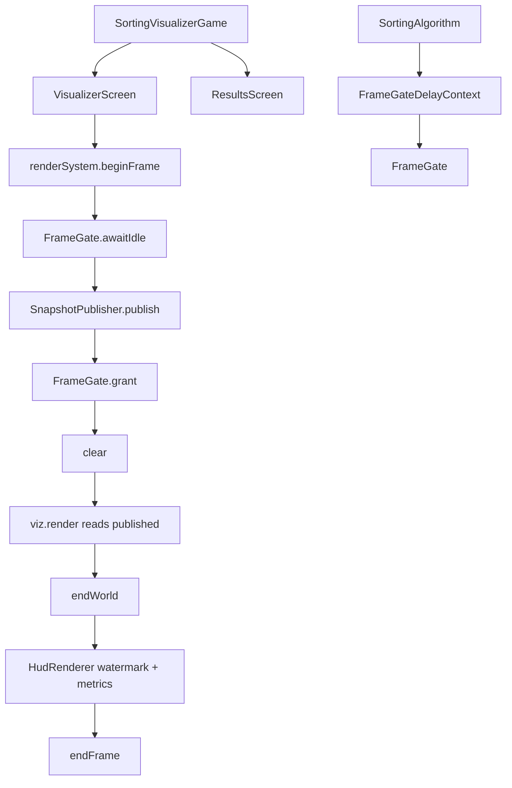

# Architecture

Versioned overview of the Sorting Algorithm Visualizer desktop app (libGDX rendering).

## Style

- **Monolith** — single Maven module, single JVM process
- **Dual toolkit UI** — libGDX/LWJGL3 canvas (`SortingVisualizerGame` + Screens + `GdxRenderSystem`) + JavaFX Settings (`SettingsFxController` / AtlantaFX Primer Light)
- **Worker thread** — algorithms run in `SortingSessionManager`; draw loop on the libGDX render thread
- **Ports** — `ArrayModel` (working + published snapshot), `DelayContext` / `FrameGate` (pacing + idle fence), `RenderSystem`, `Sound`, catalogs
- **Snapshots** — `SnapshotPublisher` copies working → published after `FrameGate.awaitIdle()`; visuals never write markers

Toolkit coexistence: bootstrap JavaFX with `Platform.startup` **before** `Lwjgl3Application`; Settings close or canvas Esc → full shutdown.

## Coordinate spaces

| Space | Origin | Y | Used by |
|-------|--------|---|---------|
| **World2D** | bottom-left | up | Bars, graphs, circles, scatters, mosaics |
| **World3D** | scene center | up | boxes / quads / spheres / 3D lines |
| **Overlay** | top-left screen | down | HUD, `drawText`, image remap (`drawImageRemap` / Overlay shader) |

Engine owns cameras; visuals submit geometry in world units (or Overlay for text/pixels). See `.cursor/evals/04-libgdx-architecture/` for the migration history.

## Package map

```text
io.github.compilerstuck
├── control/
│   ├── DesktopLauncher      # main: JavaFX then Lwjgl3Application
│   ├── SortingVisualizerGame # Game; composition root + screen navigation
│   ├── AppContext           # Façade for Settings (+ shutdown handler)
│   ├── screen/              # VisualizerScreen, ResultsScreen
│   ├── catalog/             # AlgorithmCatalog, VisualizationCatalog
│   ├── config/
│   ├── model/               # ArrayController, SnapshotPublisher, FrameGate, session/state
│   ├── render/              # RenderSystem, GdxRenderSystem, GeometryBatch2D, FramePipeline, …
│   │   └── asset/           # AppAssets, ImageRepository, ImageHandle, ImageRemapRenderer
│   ├── shuffle/
│   └── ui/settingsfx/       # JavaFX Settings + headless vm/
├── sortingalgorithms/
├── visual/                  # Visualizations + VisMath + gradient/
└── sound/
```

## Frame pipeline



## Key collaborators

| Piece | Role |
|-------|------|
| `SortingVisualizerGame` | Composition root: assets, AppContext, screen switch, shutdown |
| `VisualizerScreen` | Idle / setup delay / active sort + HUD / Esc |
| `ResultsScreen` | Comparison table via `ResultsTableRenderer` |
| `AppContext` | Settings façade + snapshot publish + injected shutdown handler |
| `ArrayController` | Working array mutated by the sort worker |
| `SnapshotPublisher` | Copy-on-publish; `publishedView()` for visuals/sound |
| `AppAssets` | Owns FreeType HUD fonts (`flip=true` for Overlay); disposed by composition root |
| `ImageRepository` | Loads/resizes user images → `ImageHandle`; GDX impl uploads source texture once |
| `GdxRenderSystem` | World2D/World3D batches + Overlay; circles/ellipses via `GeometryBatch2D` (or `--legacy-2d` ShapeRenderer) |
| `GeometryBatch2D` | Colored circle quads + low-seg ellipse lines (Phase 8) |
| `RenderSystem` | Idiomatic draw API: `fillRects` / `fillCircles` / `drawBoxes` / `drawImageRemap` / … |
| `HudRenderer` | Overlay watermark and metrics (after world pass; counters from working controller) |
| `FrameGateDelayContext` | Algorithm pacing — no graphics types |
| `VisualizationCatalog` | All visualizations with size/image constraints |
| `FrameGate` | Steps-per-frame engine + `awaitIdle` publish fence |
| `ConfigurableVisualization` | Optional per-viz settings (`CubeSettings` today); Customize dialog drafts then Apply |
| `VisualizationSettingsCodec` | Versioned JSON for clipboard export/import + `visualSettingsById` prefs blob |

## Lifecycle

Closing Settings or pressing Esc on the canvas quits both windows.

Per-visualization appearance (Cube first): Settings → Customize beside the visualization combo opens a draft dialog (Cancel / Reset / Import / Export / Apply). Applied settings hot-update the live visual and persist under `UserPreferences.visualSettingsById`.

## Build & run

See [README](../README.md). ArchUnit bans `javafx.*` and `com.badlogic.gdx.*` from algorithms/model/shuffle/view-models; visuals must not depend on `Pixmap` / `Gdx` / `gdx.files` (image I/O lives in `control.render.asset`).
